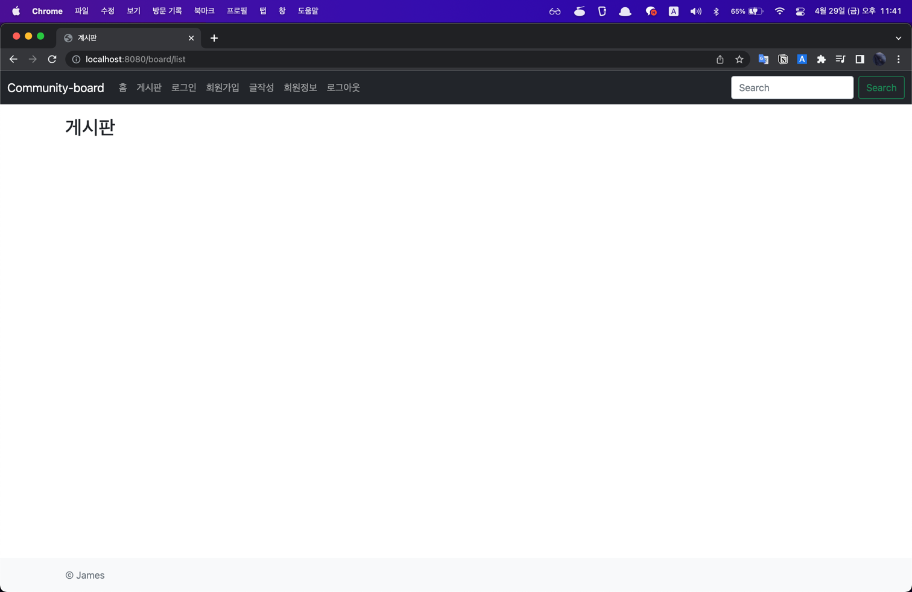
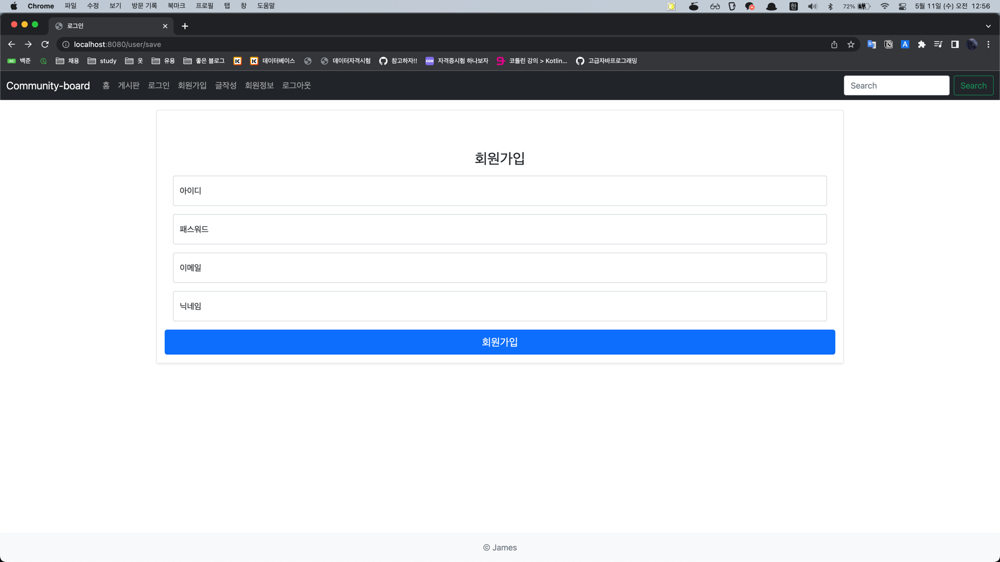
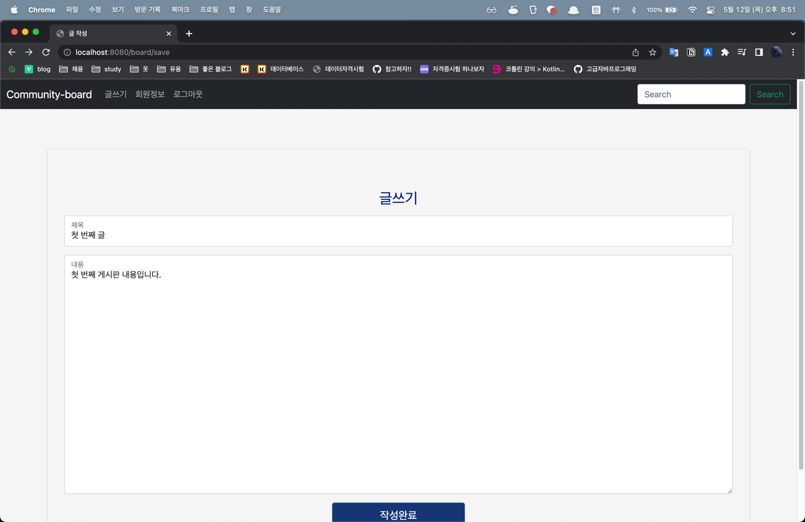
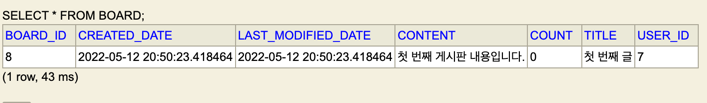

# community-board
Spring Boot, JPA 프로젝트

### 04/25/22

1. UserDto 정규표현식으로 매칭 구현
2. UserRepositoryTest BCryptPasswordEncoder 빈 등록을 통해 암호화 확인
3. UserService dto에 따른 service 구현

### 04/27/22 ~ 04/29/22

1. Thymeleaf 와 Bootstrap을 이용하여 화면 개발

### 11/5/22

1. 회원 가입 화면 개발

2. 회원가입 api test

### 12/5/22

1. 로그인 개발 및 스프링 시큐리티를 통해 로그인 세션 부여

2. 게시판 CRUD

